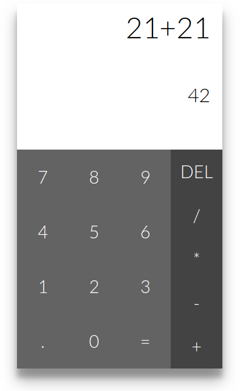

# Calculator

A simple calcualtor that allows users to perform basic arithmetic operations.

## Demo
[calculator](https://anigopale.github.io/calculator-app/)

## Installation and usage
Clone the repository and open index.html in the browser or host it on a local server

```
$ git clone https://github.com/anigopale/diary-app.git
$ cd calculator-app
$ http-server
```
## Screenshots

### The answer is 42



## License
[MIT](LICENSE)
